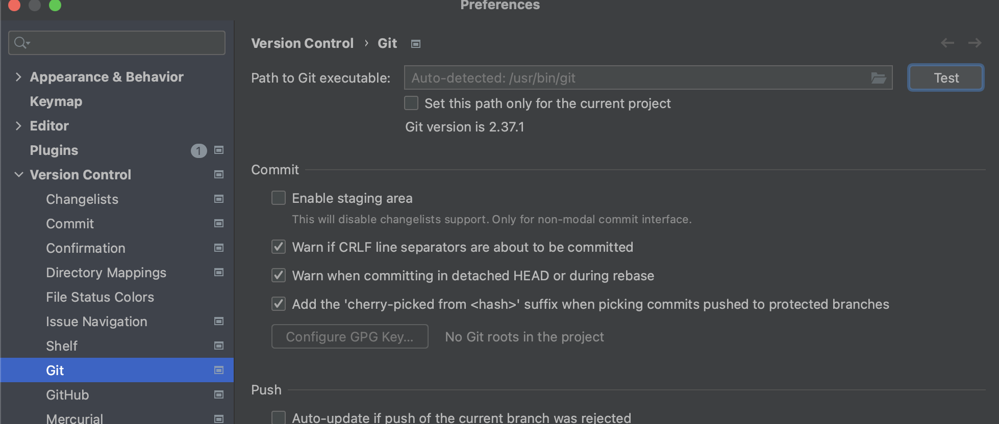
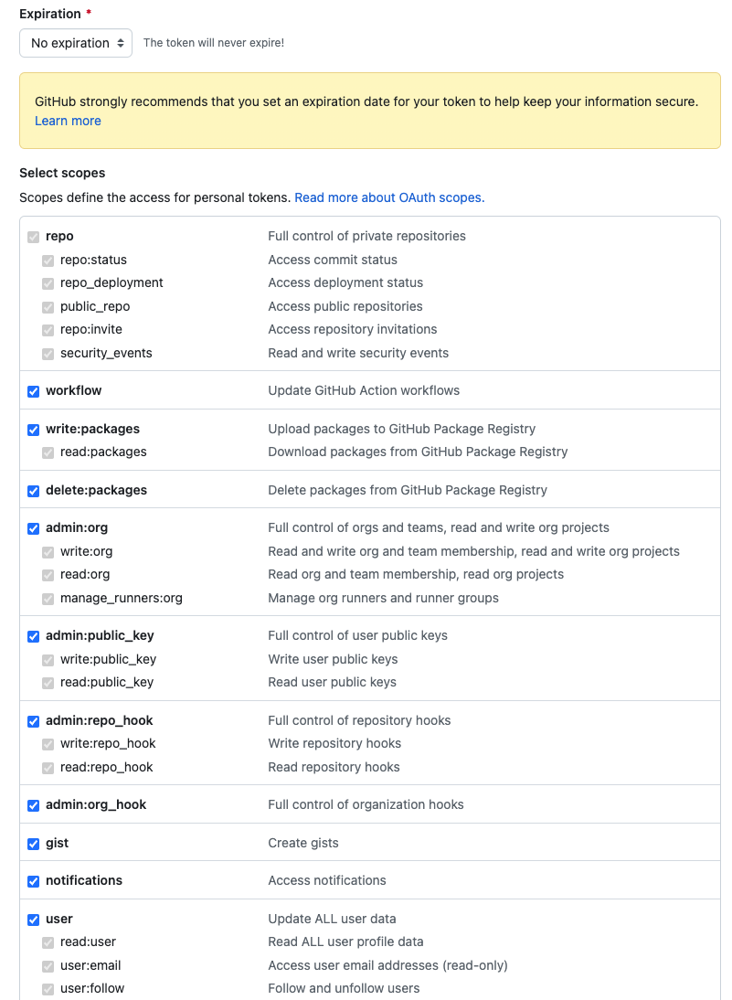
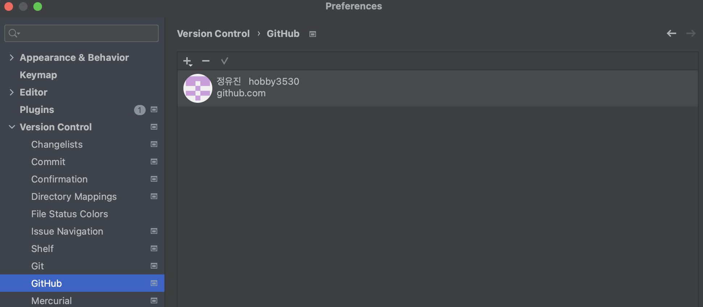

# Intellij Git 연동

## Git 설치 확인
- Intellij 메뉴바 > Intellij IDEA > Preferences > Version Control > Git > Path to Git executable의 Test 클릭


- Git 설치 완료 시, Git의 버전이 조회됨
- 설치가 되어있지 않을 경우에는 Git is not installed 라는 문구가 뜸. 이 경우에는 오른쪽에 뜨는 Download and install 링크를 클릭하여 Git 설치


## Intellij & Github 연동
- Intellij 메뉴바 > Intellij IDEA > Preferences > Version Control > GitHub
- Add Count... > Log in With Token... 클릭
    - github token을 이용하여 연동하는 방법임
    - Log in via GitHub를 클릭하여 github 계정을 통한 로그인도 가능하지만 보안 문제로 github clone, push 등이 거부될 수 있음. 권장하지 않음!
- Generate 클릭하여 github 홈페이지 접속
- New personal access token(classic) 에서 token 발급
    - `Expiration` -> 토큰 만료 일자, custom을 이용하여 만료 기간을 길게 주거나 No expiration 선택
    - `Select scopes` -> 해당 토큰으로 접근 가능한 범위 설정, 모든 체크박스 체크



- generate token을 클릭하여 토큰 발급 후, 나오는 코드 복사


- intellij 로 돌아와 복사한 token code를 입력 > Add Account
- 하위 사진처럼 계정 정보가 보인다면 github와 Intellij 연동 완료!



- github와의 연동이 완료되었으므로 intellij 를 이용하여 github clone, push, pull, merge 등을 간편하게 이용할 수 있음


## Github 레퍼지토리에 등록

- 깃허브 레퍼지토리 생성
- 터미널에서 명령어 실행
```console
$ git init
$ git add .
$ git commit -m "first init"
$ git branch -M main
$ git remote add origin https://github.com/{git 계정}/{레퍼지토리 이름}.git
$ git push -u origin main
```

- 그 이후 파일 commit & push 실습
    - command line 방식
    - Intellij 툴 사용 방식
