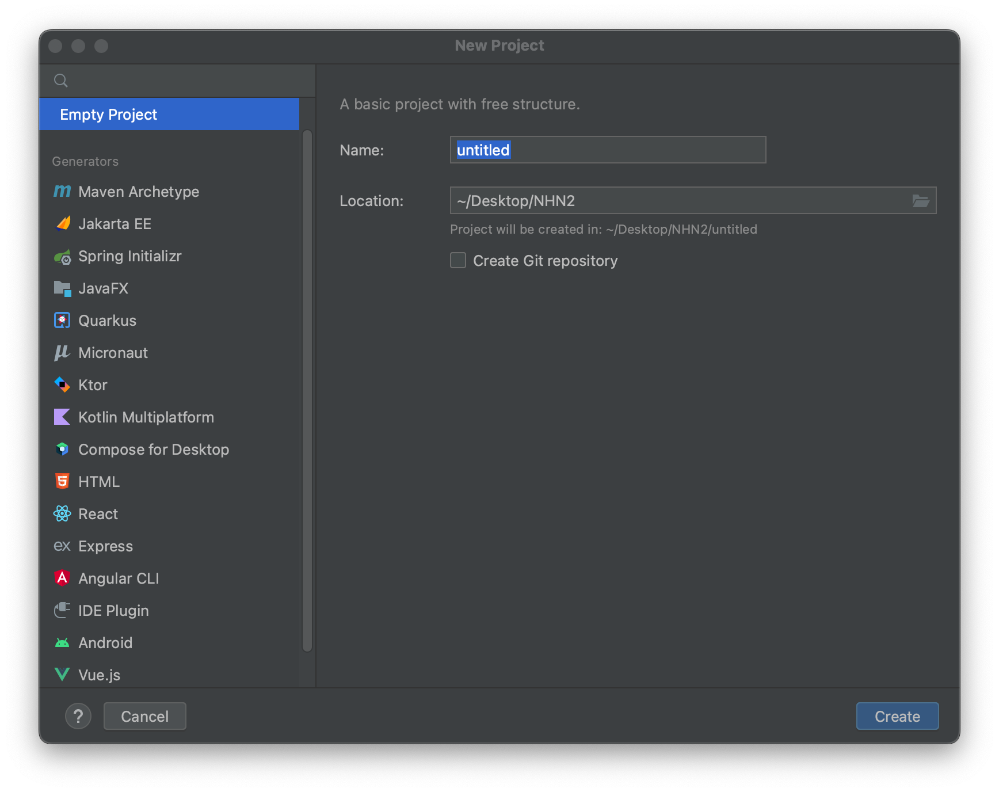
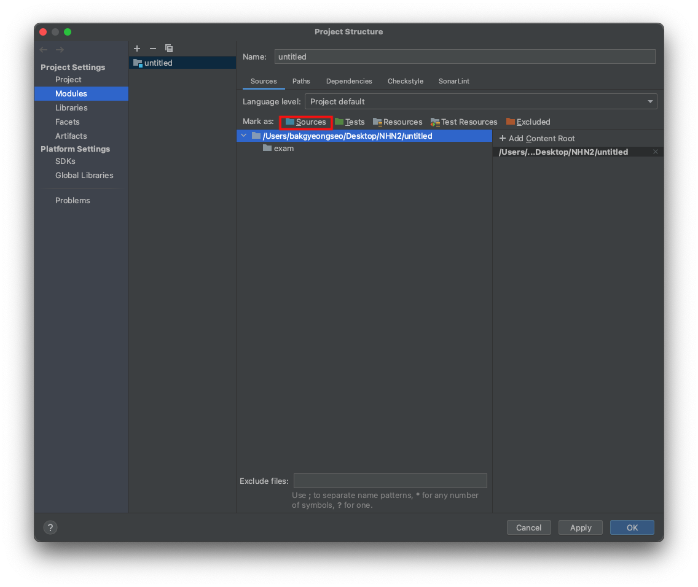

# Junit 5

## 프로젝트 생성

- Intellij -> New Project 



- 프로젝트 구조 설정 
    - 단축키 `command(⌘) + ;`
    - Sources 클릭




## 테스트 코드

**테스트 코드의 필요성**
- 프로그래밍에서 함수 및 메서드가 의도한 대로 잘 동작하는지 검증이 필요
- 프로그램을 작은 단위로 쪼개어 단위가 정확하게 동작하는지 검사함으로써 안정성을 높이는 과정


## Junit
- 자바 프로그래밍 언어용 유닛 테스트 프레임워크


### Junit5 라이브러리를 프로젝트에 추가

1. 프로젝트 구조 `command(⌘) + ;` -> Libraries -> `+` 클릭
2. Maven -> `junit.jupiter` 입력 후 검색


3. org.junit.jupiter:junit-jupiter:5.8.2 선택
4. Apply -> OK


### Junit5 사용

- 예제 용 Mathx class


```java
public class Mathx {

    private Mathx() {
    }

    public static int sum(Num n1, Num n2) {
        return n1.getNumber() + n2.getNumber();
    }

    public static int divide(Num n1, Num n2) {
        if (n2.getNumber() == 0)
            throw new IllegalArgumentException("Can't divide by zero");

        return n1.getNumber() / n2.getNumber();
    }
}
```

<br/>

**Mathx 테스트**

- `@Test` 어노테이션을 사용하여 테스트 코드를 작성 후 실행 가능
- `@DisplayName` 어노테이션으로 테스트 이름을 지정 가능
- `Assertions` 키워드를 활용하여 검증


<br/>

**실습**
- 선발시험 코드 `xxxTest.java`들을 Junit5로 옮기기


