# Git on VSC

## Git?

[Git.md](../../1일차/03.Git.md)

## With Visual Studio Code GUI

### 0. 깃허브 원격 저장소 생성하기

https://github.com/ 에서 ReadMe.md, .gitignore 를 추가하지 않은 완전히 비어있는 원격 저장소를 생성한다.
비어있는 원격 저장소가 이미 존재한다면 그대로 사용하여도 된다.
아래는 비어있는 원격 저장소를 생성하였을 때 안내되는 터미널 커맨드를 따라 Visual Studio Code 에서 Git 을 사용하는 방법이다.

### 1. Initialize Repository

- GUI

Find Source Control|Press Initialize Repository
---|---
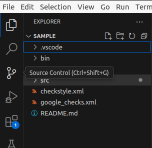|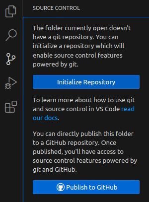

- Command

```terminal
git init
```
src
### 2. Add File
- GUI

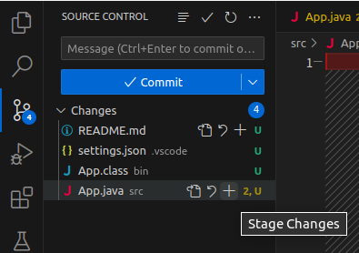

- Command
```
git add src/App.java
```

### 3. Commit changes

#### Try Commit

- GUI

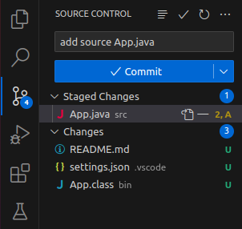

- Command

```
git commit -m "add source App.java"
```

#### Set Git User info

- GUI

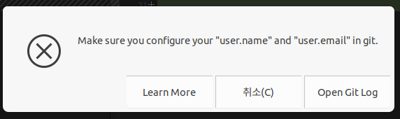
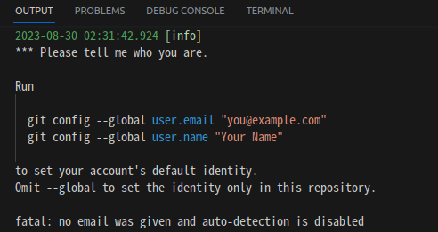

- Command

```
git config --global user.email "you@example.com"
git config --global user.name "Your Name"
```

### 4. Push Commit

#### Try Push Commits

- GUI

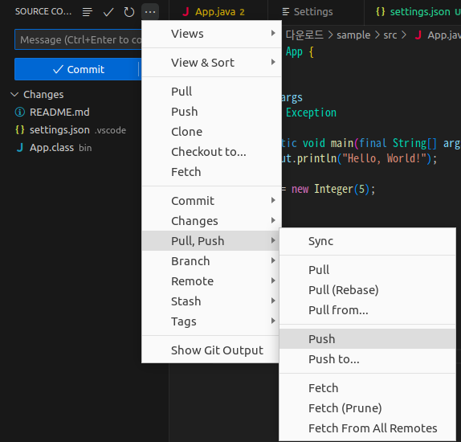

- Command

```terminal
git push ... 
```

#### Add Remote

- GUI

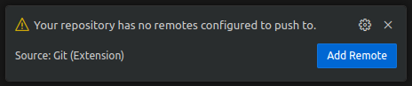

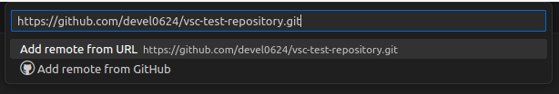

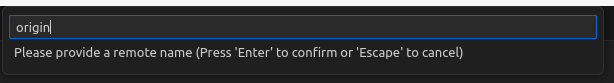

- Command

```
git remote add oring https://github.com/devel0624/vsc-test-repository.git
```

#### Remane Branch

- GUI

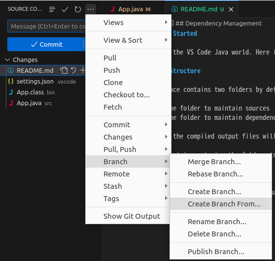
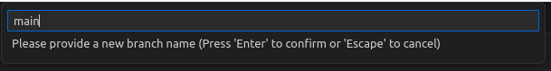


- Command

```
git branch -m main
```

#### Retry Push

- GUI

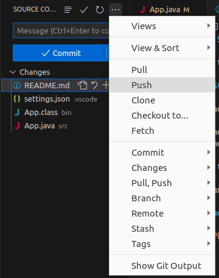|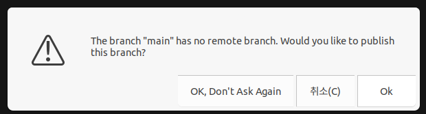
-|-

- Command

```
git push origin main
```


### Commit From Remote

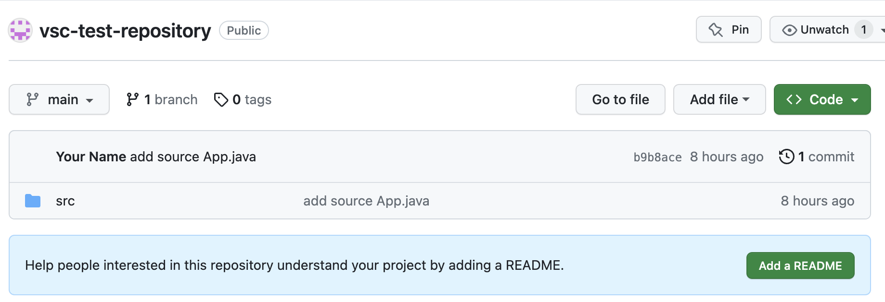|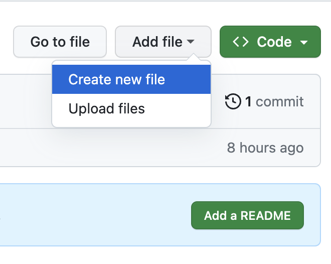
-|-
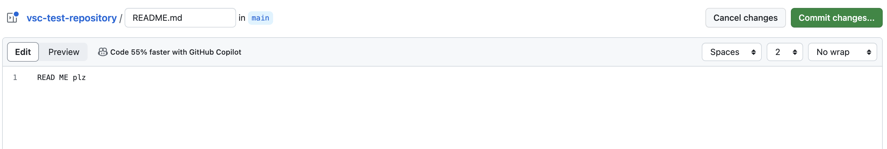|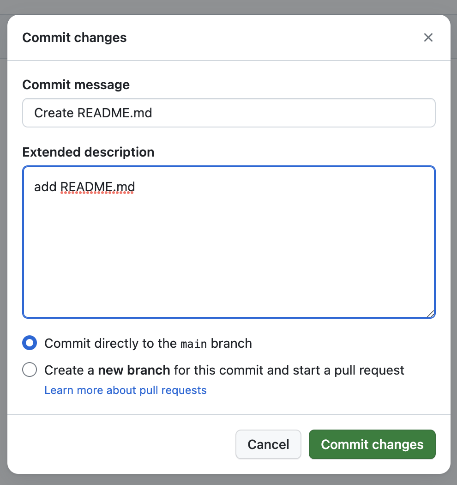

### 5. Pull Remote Commits

#### Fetch Branch

- GUI

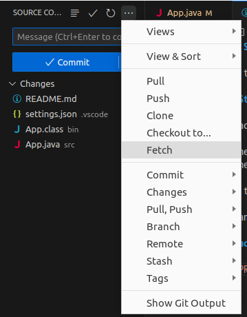

- Command

```
git fetch origin main
```

#### Pull Commits

- GUI

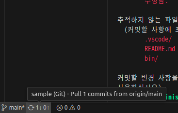|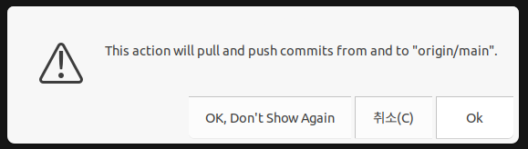
-|-

- Command

```
git pull origin main
```

#### Check Applies

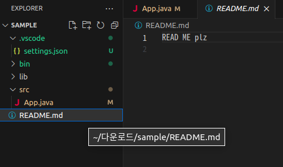