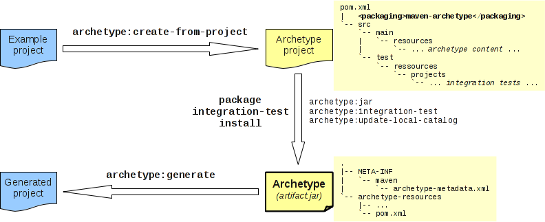
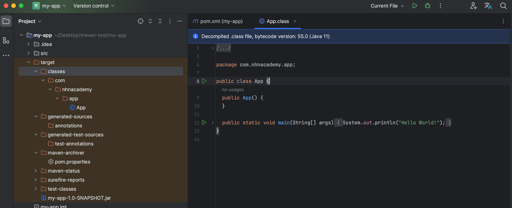

# 프로젝트생성

## mvn CommandLine

```sh
cd ~/Desktop
mkdir maven-test


mvn -B archetype:generate -DgroupId=com.nhnacademy.app -DartifactId=my-app -DarchetypeArtifactId=maven-archetype-quickstart -DarchetypeVersion=1.4
```

* `-B` : batch Mode, Interactive한 입력이나 진행상황 표시없이 명령어를 실행
* `archetype:generate` : 미리 정의된 템플릿을 기반으로 새로운 프로젝트를 생성
* `-DgroupId=com.nhnacademy.app` : Project의 그룹 ID
  * (ex) nhnacademy.com -> com.nhnacademy
* `-DartifactId=my-app` : 프로젝트의 artifact ID
  * artifact 사전적 의미 : `인공물`, `공예품`, `인공 유물`, `인공 산물`
  * Project를 식별할 수 있는 ID
* `-DarchetypeArtifactId=maven-archetype-quickstart`
  * `maven-archetype-quickstart` 이라는 archetype을 사용하여 프로젝트를 생성
  * 빠르게 시작할 수 있는 간단한 Java 프로젝트 템플릿을 제공합니다.
* `-DarchetypeVersion=1.4`  archetype version

## Project Structure

* 일관된 프로젝트 구조
* `src/main/java` : project source code
* `src/main/test` : project test code
* `pom.xml` : Project Object Model or `POM`

``` txt
my-app
|-- pom.xml
`-- src
    |-- main
    |   `-- java
    |       `-- com
    |           `-- nhnacademy
    |               `-- app
    |                   `-- App.java
    `-- test
        `-- java
            `-- com
                `-- nhnacademy
                    `-- app
                        `-- AppTest.java
```

## Intellij ( Open Maven Project )

* maven 생성한 위치로 이동

``` sh
cd ~/Desktop/maven-test/my-app/
code .
```

## The POM

``` xml
<?xml version="1.0" encoding="UTF-8"?>

<project xmlns="http://maven.apache.org/POM/4.0.0" xmlns:xsi="http://www.w3.org/2001/XMLSchema-instance"
  xsi:schemaLocation="http://maven.apache.org/POM/4.0.0 http://maven.apache.org/xsd/maven-4.0.0.xsd">
  <modelVersion>4.0.0</modelVersion>

  <groupId>com.nhnacademy.app</groupId>
  <artifactId>my-app</artifactId>
  <version>1.0-SNAPSHOT</version>

  <name>my-app</name>
  <!-- FIXME change it to the project's website -->
  <url>http://www.example.com</url>

  <properties>
    <project.build.sourceEncoding>UTF-8</project.build.sourceEncoding>
    <maven.compiler.source>1.7</maven.compiler.source>
    <maven.compiler.target>1.7</maven.compiler.target>
  </properties>

  <dependencies>
    <dependency>
      <groupId>junit</groupId>
      <artifactId>junit</artifactId>
      <version>4.11</version>
      <scope>test</scope>
    </dependency>
  </dependencies>

  <build>
    <pluginManagement><!-- lock down plugins versions to avoid using Maven defaults (may be moved to parent pom) -->
      <plugins>
        <!-- clean lifecycle, see https://maven.apache.org/ref/current/maven-core/lifecycles.html#clean_Lifecycle -->
        <plugin>
          <artifactId>maven-clean-plugin</artifactId>
          <version>3.1.0</version>
        </plugin>
        <!-- default lifecycle, jar packaging: see https://maven.apache.org/ref/current/maven-core/default-bindings.html#Plugin_bindings_for_jar_packaging -->
        <plugin>
          <artifactId>maven-resources-plugin</artifactId>
          <version>3.0.2</version>
        </plugin>
        <plugin>
          <artifactId>maven-compiler-plugin</artifactId>
          <version>3.8.0</version>
        </plugin>
        <plugin>
          <artifactId>maven-surefire-plugin</artifactId>
          <version>2.22.1</version>
        </plugin>
        <plugin>
          <artifactId>maven-jar-plugin</artifactId>
          <version>3.0.2</version>
        </plugin>
        <plugin>
          <artifactId>maven-install-plugin</artifactId>
          <version>2.5.2</version>
        </plugin>
        <plugin>
          <artifactId>maven-deploy-plugin</artifactId>
          <version>2.8.2</version>
        </plugin>
        <!-- site lifecycle, see https://maven.apache.org/ref/current/maven-core/lifecycles.html#site_Lifecycle -->
        <plugin>
          <artifactId>maven-site-plugin</artifactId>
          <version>3.7.1</version>
        </plugin>
        <plugin>
          <artifactId>maven-project-info-reports-plugin</artifactId>
          <version>3.0.0</version>
        </plugin>
      </plugins>
    </pluginManagement>
  </build>
</project>
```

## Maven Archetype Plugin

* The Archetype Plugin은 Maven에서 제공하는 도구 중 하나로, 사용자가 미리 정의된 템플릿인 `Archetype`을 기반으로 새로운 Maven 프로젝트를 생성하도록 도와주는 기능을 제공



* Archetype 기반 프로젝트 생성
  * 미리 정의된 아키타입 템플릿을 선택하여 프로젝트를 생성할 수 있습니다.
  * 프로젝트의 구조, 의존성, 설정 등을 편리하게 설정할 수 있습니다.
* 기존 Project에서 Archetype 생성
  * 이미 개발한 Project를 Archetype으로 변환하여 나중에 유사한 요구사항을 가진 프로젝트에 재사용할 수 있습니다.

## Java 11 환경을 구성한다면

* `maven.compiler.xxxx` -> 11 변경

``` xml
  <properties>
    <project.build.sourceEncoding>UTF-8</project.build.sourceEncoding>
    <maven.compiler.source>11</maven.compiler.source>
    <maven.compiler.target>11</maven.compiler.target>
    <maven.compiler.release>11</maven.compiler.release>
  </properties>
```

* `Maven-compiler-plugin`  >= 3.6.0

``` xml
<plugin>
    <artifactId>maven-compiler-plugin</artifactId>
    <version>3.8.0</version>
</plugin>
```

### package 실행

```sh
mvn package
```

``` sh
[INFO] Scanning for projects...
[INFO] 
[INFO] ---------------------< com.nhnacademy.app:my-app >----------------------
[INFO] Building my-app 1.0-SNAPSHOT
[INFO]   from pom.xml
[INFO] --------------------------------[ jar ]---------------------------------
[INFO] 
[INFO] --- resources:3.0.2:resources (default-resources) @ my-app ---
[INFO] Using 'UTF-8' encoding to copy filtered resources.
[INFO] skip non existing resourceDirectory /Users/nhn/Desktop/maven-test/my-app/src/main/resources
[INFO] 
[INFO] --- compiler:3.8.0:compile (default-compile) @ my-app ---
[INFO] Changes detected - recompiling the module!
[INFO] Compiling 1 source file to /Users/nhn/Desktop/maven-test/my-app/target/classes
[INFO] 
[INFO] --- resources:3.0.2:testResources (default-testResources) @ my-app ---
[INFO] Using 'UTF-8' encoding to copy filtered resources.
[INFO] skip non existing resourceDirectory /Users/nhn/Desktop/maven-test/my-app/src/test/resources
[INFO] 
[INFO] --- compiler:3.8.0:testCompile (default-testCompile) @ my-app ---
[INFO] Changes detected - recompiling the module!
[INFO] Compiling 1 source file to /Users/nhn/Desktop/maven-test/my-app/target/test-classes
[INFO] 
[INFO] --- surefire:2.22.1:test (default-test) @ my-app ---
[INFO] 
[INFO] -------------------------------------------------------
[INFO]  T E S T S
[INFO] -------------------------------------------------------
[INFO] Running com.nhnacademy.app.AppTest
[INFO] Tests run: 1, Failures: 0, Errors: 0, Skipped: 0, Time elapsed: 0.02 s - in com.nhnacademy.app.AppTest
[INFO] 
[INFO] Results:
[INFO] 
[INFO] Tests run: 1, Failures: 0, Errors: 0, Skipped: 0
[INFO] 
[INFO] 
[INFO] --- jar:3.0.2:jar (default-jar) @ my-app ---
[INFO] Building jar: /Users/nhn/Desktop/maven-test/my-app/target/my-app-1.0-SNAPSHOT.jar
[INFO] ------------------------------------------------------------------------
[INFO] BUILD SUCCESS
[INFO] ------------------------------------------------------------------------
[INFO] Total time:  2.428 s
[INFO] Finished at: 2023-08-17T10:46:28+09:00
[INFO] ------------------------------------------------------------------------
```

### Java 11 Compile 확인

* javap
  * java class 파일의 내용을 해석하여 바이트 코드를 읽고 분석하는데 사용되는 도구

```sh
cd target/classes/com/nhnacademy/app
javap -verbose App.class | grep "major version"
```

* Intellij



* Java major version (참고)
  
|Java version|major version|
|:---:|:---:|
|6|50|
|7|51|
|8|52|
|9|53|
|10|54|
|**11**|**55**|
|12|56|
|13|57|
|14|58|
|15|59|
|16|60|
|17|61|
|18|62|
|19|63|
|20|64|

## Generate webapp project

```sh
mvn -B archetype:generate  -DarchetypeGroupId=org.apache.maven.archetypes -DarchetypeArtifactId=maven-archetype-webapp  -DgroupId=com.nhnacademy.app -DartifactId=web-app -Dversion=1.0-SNAPSHOT
```

``` txt
project
|-- pom.xml
`-- src
    `-- main
        `-- webapp
            |-- WEB-INF
            |   `-- web.xml
            `-- index.jsp
```

## Archetype Catalog

* <https://repo.maven.apache.org/maven2/archetype-catalog.xml>

```xml
<archetype>
    <groupId>io.cdap.cdap</groupId>
    <artifactId>cdap-data-pipeline-plugins-archetype</artifactId>
    <version>6.0.0</version>
</archetype>
<archetype>
    <groupId>io.codelair</groupId>
    <artifactId>jakartaee-mp-archetype</artifactId>
    <version>1.5.0</version>
    <description>A starter archetype for a ThinWar project using Jakarta EE and MicroProfile, without any sketchy parent-pom's.</description>
</archetype>
<archetype>
    <groupId>io.codingpassion</groupId>
    <artifactId>spring-boot-full-microservice-archetype</artifactId>
    <version>0.1.1</version>
    <description>Maven Archetype which can be used to generate Spring Boot microservice application with additional configuration and tools.</description>
</archetype>
<archetype>
    <groupId>io.codingpassion</groupId>
    <artifactId>spring-boot-full-microservice-archetype</artifactId>
    <version>0.1</version>
    <description>Maven Archetype which can be used to generate Spring Boot microservice application with additional configuration and tools.</description>
</archetype>
<archetype>
    <groupId>io.confluent.maven</groupId>
    <artifactId>kafka-connect-quickstart</artifactId>
    <version>0.10.0.0</version>
    <description>A quickstart for building Kafka Connect connectors.</description>
</archetype>
```

## Maven archetype plugin 이란?

* 사용자가 template 으로부터 maven project를 생성할 수 있게 해주는 plugin 입니다. 미리 정의된 maven project template 는 archetype 이라고 불립니다.

## Archetype List

* maven repositor에 bundle로 제공 됩니다.
  * <https://maven.apache.org/archetypes>
